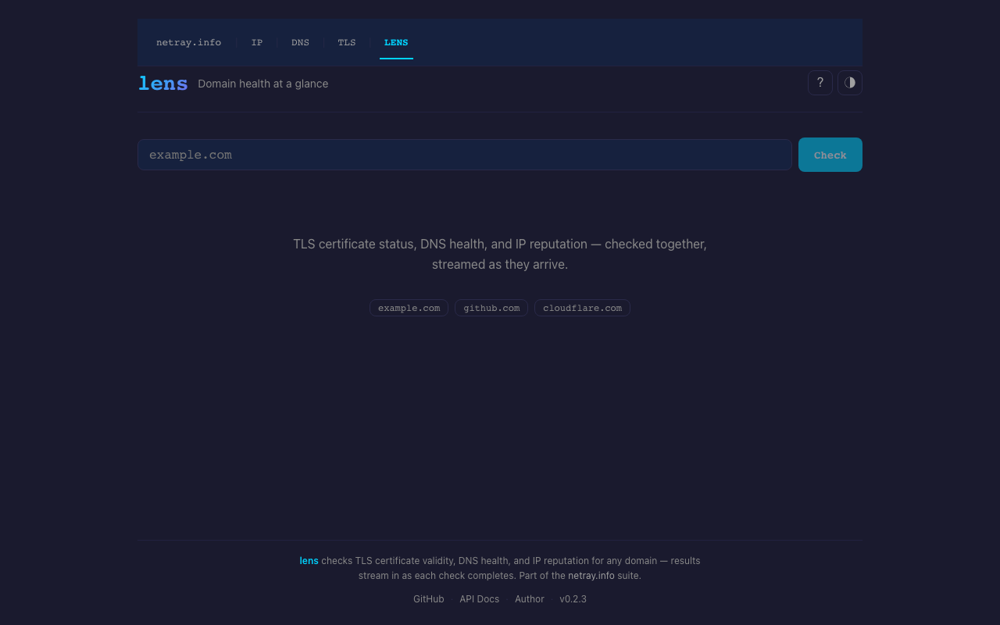
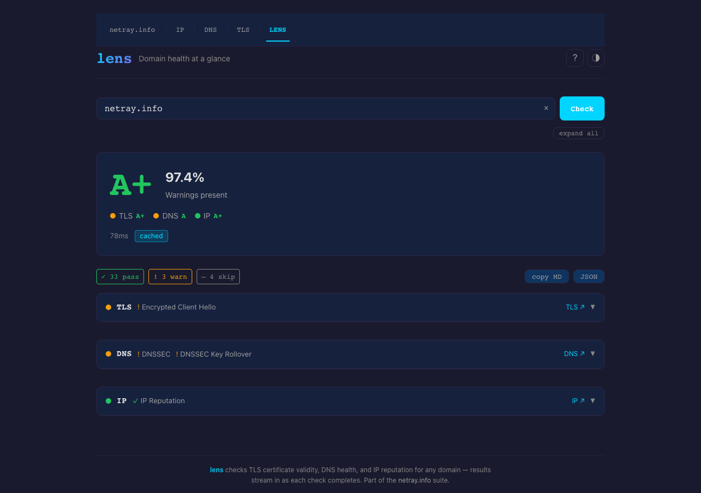
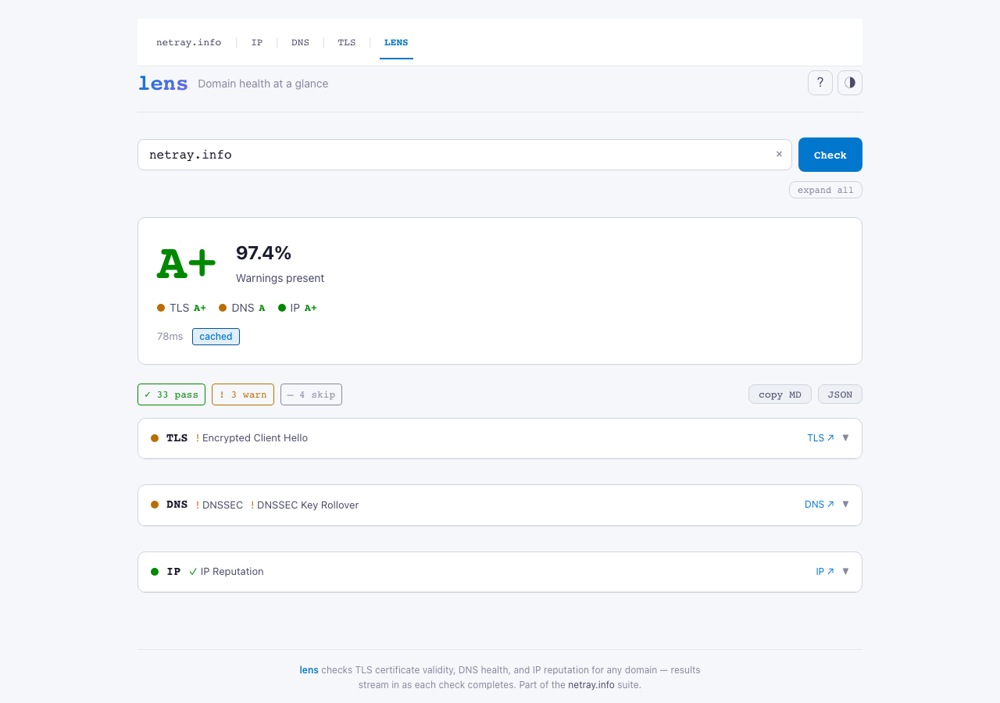
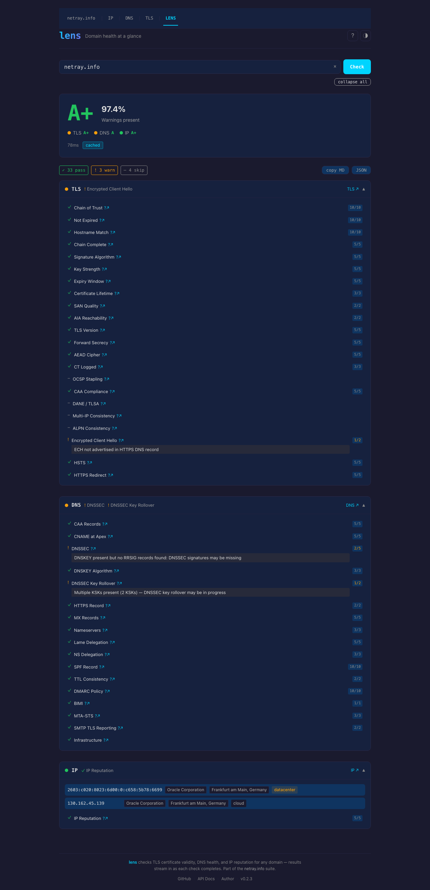
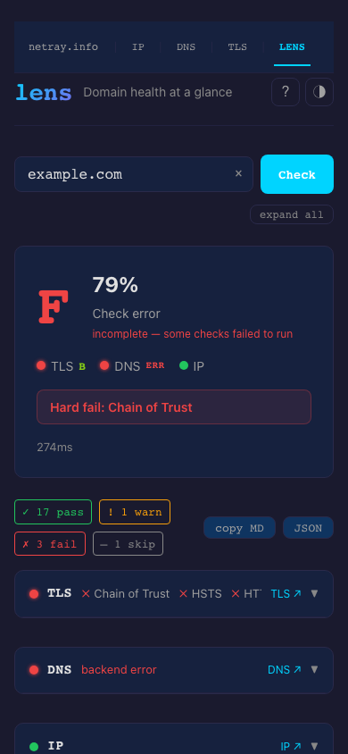
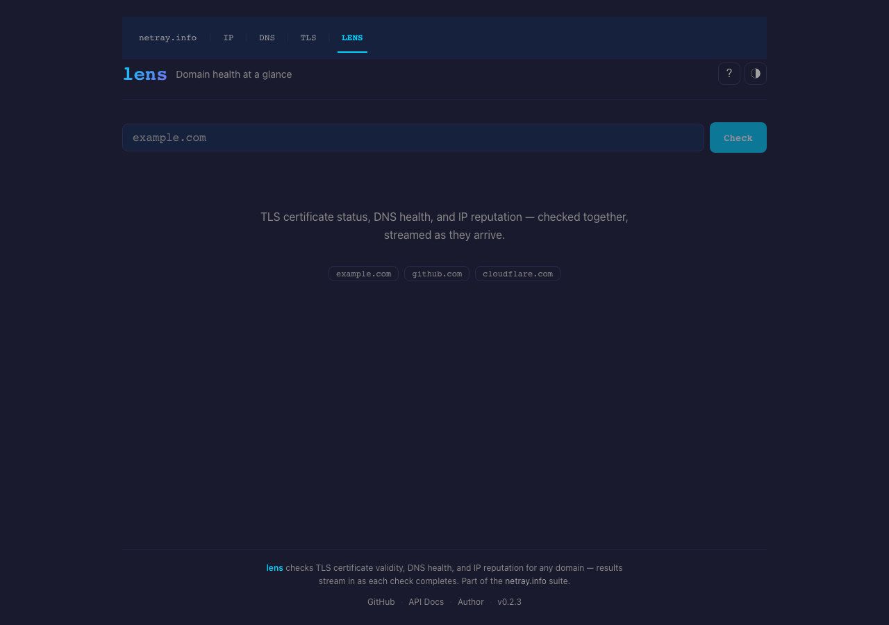

<div align="center">

# **lens** — domains, in focus

**TLS · DNS · IP reputation — three signals, one grade, streamed as they arrive.**

[](https://lens.netray.info)
[](https://lens.netray.info/docs)
[](CHANGELOG.md)
[](LICENSE)

<br>



<br>

</div>

---

## What it does

Type a domain. Press Enter. Within seconds you know:

- **TLS** — certificate chain trust, expiry, algorithm strength, OCSP stapling, CT logs, forward secrecy
- **DNS** — SPF, DMARC, DKIM, MTA-STS, DNSSEC, CAA, MX configuration, lint findings
- **IP reputation** — every resolved address classified: residential, datacenter, VPN, Tor, botnet C2

All three checks run in parallel. Results stream in as each backend responds — no spinner, no wait-and-dump. The page comes alive progressively. A weighted aggregate produces an **A+–F grade** with per-section breakdowns and hard-fail overrides for baseline security requirements.

---

## Screenshots

*Checking [netray.info](https://lens.netray.info/?d=netray.info) — A+ across all three signals.*

<table>
<tr>
<td width="50%">

**Dark theme**



</td>
<td width="50%">

**Light theme**



</td>
</tr>
<tr>
<td width="50%">

**Expanded — full check list**



</td>
<td width="50%">

**Mobile**



</td>
</tr>
</table>

---

## Try it

**Browser** — [lens.netray.info](https://lens.netray.info)

**Terminal:**
```sh
# SSE stream (results arrive as they complete)
curl -N 'https://lens.netray.info/api/check/example.com'

# Single JSON response — better for scripts and LLMs
curl -s -H 'Accept: application/json' 'https://lens.netray.info/api/check/example.com' | jq .
```

**Shareable link:** `https://lens.netray.info/?d=yourdomain.com`

---

## Use with Claude

lens has first-class Claude integration via MCP. Once installed, you can ask Claude to check domain health directly in any conversation — no copy-pasting `curl` output, no manual JSON parsing.



### Install the MCP server

**Claude Code** — run this skill from the lens repo directory:

```sh
/lens-mcp-code
```

The skill writes `~/.claude/mcp-servers/lens/server.mjs`, installs dependencies, and registers the server with `claude mcp add`. Requires Node.js ≥ 18.

**Claude Desktop** — same skill, different registration target:

```sh
/lens-mcp-desktop
```

Edits `~/Library/Application Support/Claude/claude_desktop_config.json` automatically. Restart Claude Desktop after the skill completes.

### Available tools

| Tool | What it does |
|---|---|
| `check_domain` | Full DNS + TLS + IP check for one domain — structured JSON with grade, scores, hard-fail details |
| `check_domains` | Check up to 10 domains sequentially — per-domain results, errors captured per-entry |
| `lens_meta` | Server metadata: version, backends, scoring profile, rate limits |

### Usage examples

Once installed, ask Claude things like:

> *"Check the domain health of example.com — is anything hard-failing?"*

> *"Check these three domains and compare their TLS grades: example.com, example.org, example.net"*

> *"My deploy is failing the health gate. Check example.com and tell me what's causing the F grade."*

---

## API

### Check a domain

```
GET  /api/check/{domain}
POST /api/check          {"domain": "example.com"}
```

**Default output: SSE stream.** Set `Accept: application/json`, `?stream=false`, or `"stream": false` in the POST body to get a single merged JSON object (sync mode).

```sh
# SSE — events stream in as backends respond
curl -N 'https://lens.netray.info/api/check/example.com'

# Sync — one JSON object, all sections merged
curl -s 'https://lens.netray.info/api/check/example.com?stream=false'
curl -s -H 'Accept: application/json' 'https://lens.netray.info/api/check/example.com'
curl -s -X POST -H 'Content-Type: application/json' \
  -d '{"domain":"example.com","stream":false}' \
  'https://lens.netray.info/api/check'
```

#### SSE events

| Event | Payload |
|---|---|
| `dns` | DNS findings, resolved IPs, per-check results |
| `tls` | Certificate chain, quality checks, grade |
| `http` | HTTP security headers, HTTPS redirect, CORS, cookie posture (omitted when `http_url` not configured) |
| `ip` | Per-IP classification: network type, ASN, geo |
| `summary` | Overall grade, score, section grades, `hard_fail`, `hard_fail_reason` |
| `done` | Domain, duration_ms, cached flag |

#### Sync response

```json
{
  "dns":     { "status": "ok", "findings": [...], "resolved_ips": [...] },
  "tls":     { "status": "ok", "checks": [...], "grade": "A" },
  "ip":      { "status": "ok", "ips": [...] },
  "summary": {
    "overall": "A", "grade": "A", "score": 87.0,
    "hard_fail": false, "hard_fail_reason": null,
    "sections": { "dns": "B", "tls": "A", "ip": "A+" }
  },
  "done": { "domain": "example.com", "duration_ms": 412, "cached": false }
}
```

`hard_fail_reason` is a human-readable string when `hard_fail` is `true` (e.g. `"SPF Record, Chain of Trust"`), otherwise `null`.

#### Caching

Results are cached for 5 minutes. Cache hits return `X-Cache: HIT` and complete in milliseconds.

### Other endpoints

| Endpoint | Description |
|---|---|
| `GET /api/meta` | Server version, backends, scoring profile, rate limits |
| `GET /health` | Liveness probe |
| `GET /ready` | Readiness probe |
| `GET /api-docs/openapi.json` | OpenAPI 3.1 spec |
| `GET /docs` | Interactive API docs (Scalar UI) |

### CI / Pipeline integration

Gate deploys on domain health — if the grade drops below B, fail the build:

```yaml
- name: Domain health check
  run: |
    curl -sf -H 'Accept: application/json' \
      "https://lens.netray.info/api/check/$DOMAIN" \
    | jq -e '.summary.grade | test("^(A|B)")'
```

Or pull structured data for reporting:

```sh
curl -s -H 'Accept: application/json' 'https://lens.netray.info/api/check/example.com' \
  | jq '{grade: .summary.grade, score: .summary.score, hard_fail: .summary.hard_fail_reason}'
```

---

## Scoring

This section is the authoritative description of the scoring algorithm. Any change to `src/scoring/` must update this section in the same commit.

### Algorithm

Each backend returns a set of named checks. Every check has a status: `pass`, `warn`, `fail`, `not_found`, `skip`, or `error`.

1. **Per-check score**: `pass` = full weight, `warn` = half weight, `fail`/`not_found` = 0. `skip` and `error` are excluded entirely.
2. **Section score**: weighted sum of earned points ÷ weighted sum of possible points, as a percentage.
3. **Overall score**: weighted average of section scores.
4. **Section states**: a section can be `Scored` (contributes to overall), `Errored` (excluded silently), or `NotApplicable` (excluded; reason reported in `summary.not_applicable`).
5. **Hard-fail overrides**: certain failures force the overall grade to **F** regardless of the numeric score.
6. **Letter grade**: score mapped to thresholds.

### Section weights

| Section | Weight | Notes |
|---|---|---|
| TLS   | 35% | Certificate validity and transport security are foundational |
| DNS   | 20% | DNS infrastructure health (DNSSEC, CAA, NS delegation) |
| HTTP  | 20% | HTTP security headers, HTTPS redirect, CORS, and cookie posture (requires spectra backend) |
| Email | 15% | Email authentication (SPF, DKIM, DMARC) and receiving infrastructure (requires beacon backend) |
| IP    | 10% | Reputation informs risk but is beyond the domain owner's direct control |

The HTTP and Email sections are optional. When not configured, the scoring engine rebalances proportionally across active sections (weights are relative, not fixed-sum).

### Email section: sending vs receiving

The email section is split into four buckets:

| Bucket | Weight | Applies to |
|---|---|---|
| `email_authentication` | 10 | Every domain — SPF, DKIM, DMARC |
| `email_infrastructure` | 5  | Domains with MX records only — MX, FCrDNS, DNSBL |
| `email_transport`      | 5  | Domains with MX records only — MTA-STS, TLS-RPT, DANE |
| `email_brand_policy`   | 2  | Domains with MX records only — BIMI, DMARC policy |

When a domain has no MX records (parked domain), the three receiving buckets are marked **not-applicable** and use `CheckVerdict::Skip`. They contribute 0 to both earned and possible points — no penalty. Only `email_authentication` (weight 10) is scored, as SPF/DKIM/DMARC apply to every domain for outbound mail protection.

### Grade thresholds

| Grade | Score | Meaning |
|---|---|---|
| A+ | ≥ 97% | Exemplary — all checks pass |
| A  | ≥ 90% | Excellent — minor gaps only |
| B  | ≥ 75% | Good — some non-critical findings |
| C  | ≥ 60% | Fair — notable gaps, action recommended |
| D  | ≥ 40% | Poor — significant issues present |
| F  | < 40% | Failing — or hard-fail override triggered |

### Hard failures

These conditions force an **F** regardless of the numeric score:

| Condition | Why |
|---|---|
| Untrusted TLS chain | Certificate not signed by a trusted CA — browsers reject it |
| Expired certificate | Any certificate in the chain |

### Check weight tiers

| Weight | Meaning |
|---|---|
| 10 | Security-critical — failure has immediate, severe consequences |
| 5  | Important — strongly recommended by standards or best practice |
| 3  | Significant — meaningful impact on deliverability or security posture |
| 2  | Advisory — good practice, but failure is not operationally harmful |
| 1  | Informational — low-cost improvement opportunity |

### SSE events

| Event | When emitted | Key fields |
|---|---|---|
| `dns` | After DNS backend | `status`, `headline`, `checks`, `detail_url` |
| `tls` | After TLS backend | `status`, `headline`, `checks`, `detail_url` |
| `http` | After HTTP backend (optional) | `status`, `headline`, `checks`, `detail_url` |
| `email` | After email backend (optional) | `status`, `grade`, `buckets`, `headline`, `detail_url` |
| `ip` | After IP backend | `status`, `headline`, `checks`, `addresses`, `detail_url` |
| `summary` | After all backends | `grade`, `score`, `sections`, `not_applicable`, `hard_fail` |
| `done` | Stream complete | `domain`, `duration_ms`, `cached` |

The `email` event `status` is one of: `pass`, `warn`, `fail`, `error`, `not_applicable`.
The `summary` event includes `not_applicable: Record<string, string>` (always present, may be empty).

### Custom profiles

The scoring profile is defined in TOML. The default is embedded in the binary; override it with `scoring.profile_path` in `lens.toml`.

<details>
<summary>Profile format (v2)</summary>

```toml
[meta]
name = "default"
version = 2

[sections.tls]
weight = 35
hard_fail = ["chain_trusted", "not_expired"]

[sections.tls.checks]
chain_trusted    = 10
not_expired      = 10
hostname_match   = 10
chain_complete   = 5
strong_signature = 5
key_strength     = 5
expiry_window    = 5
tls_version      = 5
forward_secrecy  = 5
aead_cipher      = 5
ocsp_stapled     = 3
ct_logged        = 3

[sections.dns]
weight = 20
hard_fail = []

[sections.dns.checks]
dnssec = 5
caa    = 5
ns     = 3

[sections.email]
weight = 15
hard_fail = []

[sections.email.checks]
email_authentication = 10
email_infrastructure = 5
email_transport      = 5
email_brand_policy   = 2

[sections.http]
weight = 20
hard_fail = []

[sections.http.checks]
https_redirect   = 5
hsts             = 5
security_headers = 5
cors             = 3
cookie_secure    = 2
hygiene          = 2

[sections.ip]
weight = 10
hard_fail = []

[sections.ip.checks]
reputation = 5

[thresholds]
"A+" = 97
"A"  = 90
"B"  = 75
"C"  = 60
"D"  = 40
"F"  = 0
```

</details>

---

## Configuration

```sh
cp lens.example.toml lens.toml
```

```toml
[server]
bind = "0.0.0.0:8082"
metrics_bind = "127.0.0.1:9090"
# trusted_proxies = ["10.0.0.0/8"]

[backends]
dns_url = "https://dns.netray.info"
tls_url = "https://tls.netray.info"
ip_url  = "https://ip.netray.info"
# backend_timeout_secs = 20

[cache]
enabled = true
ttl_seconds = 300

[rate_limit]
per_ip_per_minute = 10
per_ip_burst = 3
global_per_minute = 100
global_burst = 20

[scoring]
# profile_path = "profiles/default.toml"   # override built-in default
```

Override any value with environment variables: `LENS_` prefix, `__` for nesting — e.g. `LENS_SERVER__BIND=0.0.0.0:8082`.

### Customizing the apex landing

The apex page (hero copy, brand, example chips, footer, OG metadata) is driven by a `[site]` config section. Twelve fields cover every visible apex string:

```toml
[site]
title          = "yourdomain.example — domain health, in seconds"
description    = "Run a free DNS, TLS, HTTP, and email health check on any domain."
brand_name     = "yourdomain"
brand_tagline  = "domain health, in seconds"
hero_heading   = "How healthy is your domain?"
hero_subheading = "DNS, TLS, HTTP, and email — checked in parallel, one grade, usually under a second."
status_pill    = "open source · self-hosted · built in Rust"
example_domains = ["yourdomain.example", "github.com", "cloudflare.com"]
trust_strip    = "No account · No ads · Open source · Self-hostable"
og_site_name   = "yourdomain.example"
# og_image     = "https://yourdomain.example/og-card.png"
# footer_about = "..."
# footer_links = [{ label = "Tools", href = "/tools", external = false }]
```

Every field also takes a `LENS_SITE__*` env override, so an operator can rebrand without editing files:

```sh
LENS_SITE__HERO_HEADING="Is your domain healthy?" \
LENS_SITE__BRAND_NAME="acme" \
docker compose restart lens
```

What is **not** configurable: the six grade descriptors (`A+ excellent — ahead of most domains` etc.), per-check `fix_hint` / `fix_owner` copy, check labels and weights, and scoring thresholds. These are product semantics — see `specs/sdd/product-repositioning.md` §11 for the rationale.

Values are HTML-escaped before being substituted into the SPA shell, so an `<script>` in a config value renders as text, not as executable script.

---

## Building

Prerequisites: Rust toolchain, Node.js (for the frontend).

```sh
make          # frontend + release binary
make dev      # cargo run (hot-reloads nothing, but starts quickly)
make test     # Rust unit + integration tests + frontend tests
make ci       # full gate: fmt, clippy, test, frontend build, audit

# Two-terminal dev workflow
make frontend-dev   # Vite dev server on :5174 (proxies /api/* to :8082)
make dev            # cargo run on :8082
```

The release binary embeds the compiled frontend — no separate static file hosting required.

---

## Tech stack

**Backend** — Rust · Axum 0.8 · reqwest · tokio · utoipa (OpenAPI 3.1) · tower-governor (GCRA rate limiting) · moka (TTL cache)

**Frontend** — SolidJS 1.9 · Vite · TypeScript (strict) · @netray-info/common-frontend

**Part of** — [netray.info](https://netray.info) suite: [IP](https://ip.netray.info) · [DNS](https://dns.netray.info) · [TLS](https://tls.netray.info) · [HTTP](https://http.netray.info) · [Email](https://email.netray.info)

---

## License

MIT — see [LICENSE](LICENSE).
